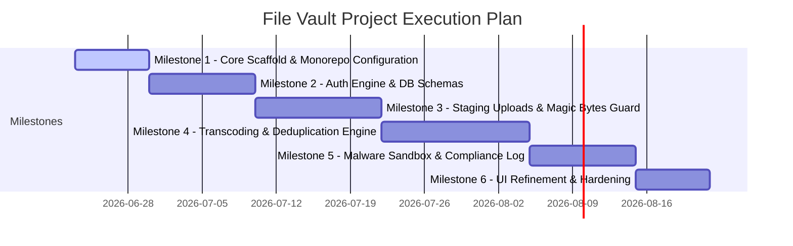
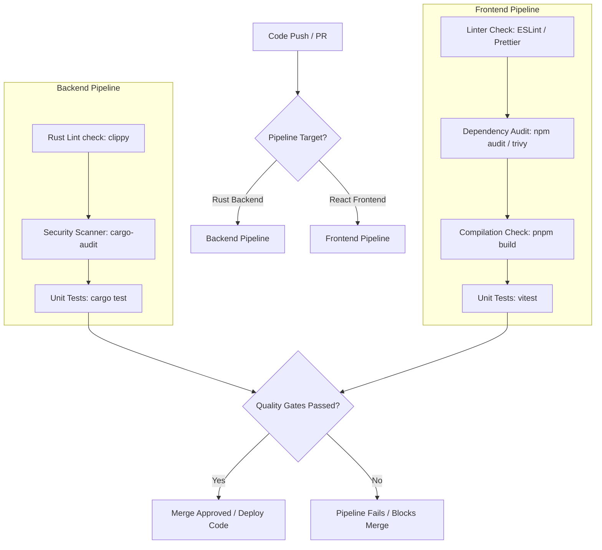

Welcome, Agent. You are operating as a core software developer inside the File Vault Monorepo. To maintain high system integrity, ensure safety against architectural regression, and prevent security vulnerability injections, you must follow the instructions detailed below.

## 1. System Guardrails & Architecture Rules
- **Monorepo Structure:** Keep backend implementation focused in `apps/api` (Rust) and frontend code in `apps/web` (React/TS). Never mix tooling or dependencies.
- **State Integrity:** The Rust backend is the source of truth for file authorization, metadata, and background checks. The frontend must never make direct-write modifications to database schemas or buckets without acquiring pre-signed auth signatures or signed tokens from the backend.
- **Memory Safety & Error Handling:**
  - **In Rust:** Avoid using `unwrap()` or `expect()`. Gracefully handle all operational failures using robust standard patterns with `thiserror` and bubble up errors using `anyhow`. Use streaming buffers for file processing to avoid out-of-memory errors on large files.
  - **In TypeScript:** Enforce strict type compliance. Do not use `any` casting. Use explicit structural guards when processing variable API responses.

## 2. Coding Standards

### Tailwind CSS v4 Compliance
Tailwind v4 uses a CSS-first configuration model. Do not attempt to read or modify or create, with version 4 it not required a `tailwind.config.js` file.
- All configuration changes, theme extensions, and custom fonts must be configured directly within `apps/web/src/index.css` using `@theme` syntax:
  ```css
  @import "tailwindcss";

  @theme {
    --color-brand-primary: #10b981;
    --color-brand-accent: #059669;
  }
  ```

### Rust (Axum Framework)
- Organize controllers and application state dependencies explicitly. Implement routes as small, highly targeted handlers wrapped around modular, testable domain services.
- Database access must be routed through `sqlx` prepared parameter structures to completely prevent SQL injection vectors.

## 3. Security Requirements
- **Input Sanitization:** Validate and clean all user inputs. Sanitize filenames to alphanumeric characters, dashes, and periods.
- **Row Level Security (RLS):** Every migration creating new public tables must explicitly append an `ALTER TABLE ... ENABLE ROW LEVEL SECURITY;` instruction and provide comprehensive isolation policies matching the accessing user's ID.
- **Magic Byte Inspections:** File validation must read magic bytes from the binary stream. Do not rely on MIME metadata provided by browser clients.

## 4. Testing Protocols
- **Unit Testing (Rust):** All business logic services (such as format parsers and sanitization utilities) must include localized tests placed in a matching inline module:
  ```rust
  #[cfg(test)]
  mod tests {
      use super::*;
      #[test]
      fn test_sanitize_filename() { ... }
  }
  ```
- **React Testing (TS):** Components must be covered with vitest/React Testing Library checks validating functional states (e.g., upload progress transition states, file search rendering).

## 5. Git & Code Promotion Workflow
- **Branch Naming Standard:**
  - Features: `feat/short-description`
  - Hotfixes: `fix/short-description`
  - Refactoring: `refactor/short-description`
- **Commit Messages:** Must comply with Conventional Commits specifications (e.g., `feat(api): integrate clamav scanning engine`).

### Pull Request Checklist
Before requesting review or finishing an autonomous issue fix, verify that:
- [ ] All Rust compiler checks pass without warnings (`cargo clippy --all-targets`).
- [ ] The TypeScript frontend compiles successfully without errors (`pnpm build`).
- [ ] Database migration patterns are fully idempotent and RLS-compliant.
- [ ] There are no regressions in existing storage-optimization behaviors.

## 6. Definition of Done (DoD)
A task is classified as "Done" if and only if:
1. The code builds flawlessly on both frontend and backend.
2. The code passes all pipeline test suites and security scanners.
3. RLS integration is fully tested and secure against side-channel leaks.
4. Error paths are gracefully handled and return meaningful error messages to the client application.


---

# Milestone Roadmap

To scale development smoothly, the construction is broken into distinct milestones.



### Milestone 1: Core Scaffold & Monorepo Configuration
*   **Goal:** Establish a clean Cargo + PNPM workspace workspace skeleton.
*   **Deliverables:** Base workspaces, shared configurations, CI/CD workflow files, Tailwind v4 base style installation.
*   **Dependencies:** None.
*   **Estimated Complexity:** Low (3/10).
*   **Risks:** Toolchain version skew. *Mitigation:* Explicitly declare node and rust-toolchain version constraints in root lockfiles.
*   **Test Strategy:** Run pipeline checks to confirm clean empty compilation of Rust and TypeScript targets.

### Milestone 2: Auth Engine & DB Schemas
*   **Goal:** Fully integrated authentication flow and relational database layer.
*   **Deliverables:** Migration scripts deploying custom RLS profiles, Rust authorization middlewares validating JWT signatures emitted by Supabase Auth, React Context providers wrapping Supabase Auth actions.
*   **Dependencies:** Milestone 1 complete.
*   **Estimated Complexity:** Medium (5/10).
*   **Risks:** Loose RLS configurations exposing databases. *Mitigation:* Integrate automatic migration tests verifying execution failures when querying schemas as unauthenticated guests.
*   **Test Strategy:** Integration tests mimicking authentication exchanges, verifying active session states, and testing access control rules.

### Milestone 3: Staging Uploads & Magic Bytes Guard
*   **Goal:** Secure client-to-staging file upload pipeline.
*   **Deliverables:** React dropzone interface tracking upload state progress, Axum signing service generating pre-signed staged TUS paths, and Rust post-upload pipeline inspecting magic bytes.
*   **Dependencies:** Milestone 2 complete.
*   **Estimated Complexity:** High (7/10).
*   **Risks:** Large files crashing backend memory buffers. *Mitigation:* Enforce strict streaming chunking rules when routing files through verification engines.
*   **Test Strategy:** Mock upload sequences sending corrupted headers or invalid file extension payloads, ensuring they are rejected.

### Milestone 4: Transcoding & Deduplication Engine
*   **Goal:** Implement file-system optimizations.
*   **Deliverables:** Client-side React Web Worker transcoding PNGs and JPEGs into highly optimized WebP format, server-side ZStandard stream compression for uncompressed text MIME families, and transactional database routines handling hash-matching deduplication.
*   **Dependencies:** Milestone 3 complete.
*   **Estimated Complexity:** High (8/10).
*   **Risks:** Client browser threads stalling on giant file hashing sequences. *Mitigation:* Bound client hash computation size limits; offload all heavy operations to isolated Web Worker instances.
*   **Test Strategy:** Assert database state to ensure multiple uploads of the exact same binary payload generate zero storage overhead while maintaining valid metadata tracking.

### Milestone 5: Malware Sandbox & Compliance Log
*   **Goal:** Secure the upload chain using an active scanner and compliance tracking.
*   **Deliverables:** Background worker routing staged objects to ClamAV, clean-up processes managing quarantine lifecycles, and a secure logger writing historical system usage to transactional Postgres audit storage.
*   **Dependencies:** Milestone 4 complete.
*   **Estimated Complexity:** Medium-High (7/10).
*   **Risks:** High pipeline latency overhead introduced by sequential antivirus scanning. *Mitigation:* Run the scan pipeline asynchronously in a separate worker thread. Inform the client UI immediately via Server-Sent Events or active pooling updates when state shifts.
*   **Test Strategy:** Inject simulated EICAR threat payloads into staging to verify they are identified and quarantined.

### Milestone 6: UI Refinement & Hardening
*   **Goal:** Production launch preparation and client styling.
*   **Deliverables:** Responsive Tailwind CSS v4 layout, advanced file structure hierarchy queries (folders, nesting), search engine, rate-limiting rules applied on public API interfaces.
*   **Dependencies:** Milestone 5 complete.
*   **Estimated Complexity:** Medium (5/10).
*   **Risks:** Heavy nested folders crashing layout performance. *Mitigation:* Paginate folder content fetches and optimize recursive tree renderings.
*   **Test Strategy:** End-to-end user navigation validation using Playwright testing sequences.

---

# CI/CD Design

The system relies on structured GitHub Actions pipelines enforcing high-quality gates across all code branches.



### Quality Gate Metrics
*   **Test Coverage:** Minimum $80\%$ unit test coverage across the Rust API application and frontend core helper libraries.
*   **Performance Budgets:** 
    *   **Frontend:** Main SPA JS bundle must stay $< 250\text{ KB}$ (gzipped).
    *   **Backend:** Baseline $p95$ metadata response time $< 150\text{ms}$ under load.
*   **Accessibility (a11y):** Strict compliance with Web Content Accessibility Guidelines (WCAG) 2.1 AA specifications. Checked using automated `axe-core` tests during Playwright execution runs.

---

# Risk Register

These active runtime and architectural risks must be tracked throughout the application lifecycle:

| Risk Code | Risk Description | Probability | Impact | Mitigation Plan |
| :--- | :--- | :--- | :--- | :--- |
| **RSK-01** | **Storage Allocation Egress Spike:** Malicious users sharing viral links with broad public consumers, causing heavy data transfer bills. | High | Critical | Implement an absolute daily egress volume limit per user. Pre-signed access link generations are bound to tight lifetimes (default $15$ minutes). |
| **RSK-02** | **Denial of Service via Hash Heavy Processing:** Attacker uploads multiple unique files concurrently, forcing backend engines to constantly run hashing loops and magic byte extractions. | Medium | High | Put upload intents under an API rate-limiting guard using token-bucket rules. Set concurrent upload processing limits per user account. |
| **RSK-03** | **Memory Exhaustion on Server:** Processing large files directly in system RAM, resulting in memory allocation failures. | Low | Critical | Force all storage manipulation mechanisms to act exclusively on stream processors. Enforce payload body boundaries in Axum configuration ($< 500\text{MB}$). |
| **RSK-04** | **Side-Channel Existence Invalidation:** Attackers confirming if a sensitive document is on the server by attempting to upload it and observing instantaneous "upload complete" (deduplicated) responses. | Medium | Medium | **Never** perform pre-upload deduplication checks. The client must upload the file in its entirety. The deduplication evaluation happens post-upload on the backend, ensuring zero client visibility into whether a file was deduplicated or written to new storage. |
