# Executive Summary

This document outlines the end-to-end design for **File Vault**, a highly optimized, secure, and cost-efficient file storage platform built on a Rust backend, a React + TypeScript frontend utilizing Tailwind CSS v4, and Supabase for database, authentication, and physical object storage.

### Key Architectural Hypotheses & Trade-offs
*   **The Compression Myth vs. Reality:** Compression is not a one-size-fits-all solution. Attempting to compress media formats (JPEG, PNG, MP4, MP3) or zipped archives (ZIP, PDF, DOCX) yields zero storage savings while consuming precious CPU cycles and increasing latency. We limit compression strictly to high-entropy text assets (CSV, JSON, log files) and replace client-side compression of images with *format translation* (converting heavy PNGs/JPEGs to WebP/AVIF).
*   **Security-First Deduplication:** To prevent side-channel attacks where an attacker can determine if a specific file exists on our servers by querying its hash, we enforce a **strict upload-first deduplication flow**. Pre-upload hash checking is disabled. Users must upload the full file; the deduplication analysis occurs post-stream on the server, ensuring proof-of-ownership of the file bytes.
*   **Hybrid Upload Flow:** Directly uploading large files through a monolithic Rust API degrades server throughput due to heavy I/O blocking. Conversely, direct client-to-Supabase uploads bypass our pre-upload security checks. We resolve this by using a **signed token negotiation pattern**: clients request upload clearance from the Rust backend, upload directly to a restricted staging bucket in Supabase via resumable protocols (TUS), and a Rust-driven background worker validates, scans, and migrates the file to production storage.

---

# Product Specification

## Vision
To build a highly responsive, secure file vault that maximizes the constraints of free-tier or budget-capped cloud storage through aggressive post-upload deduplication, client-side format optimization, and asynchronous, zero-trust backend scanning.

## User Personas
1.  **Elena (The Remote Freelancer):** Needs to upload diverse client deliverables (high-res PDFs, raw design files, CSV spreadsheets) quickly and generate expiring download links. She is highly sensitive to slow upload speeds and lacks technical knowledge of file compression.
2.  **Marcus (The Compliance Auditor):** Manages historical business logs and document archives. He requires absolute assurance that files are scanned for malware, immutable once archived, and accompanied by a detailed access audit trail.

## User Stories
*   *As Elena*, I want to drag and drop multiple files simultaneously and see real-time progress bars so that I am not left guessing when my upload will complete.
*   *As Elena*, I want my large image uploads to be optimized transparently on my device before they are sent, saving my bandwidth and storage quota.
*   *As Marcus*, I want every upload to run through an automated antivirus check so that I do not accidentally distribute infected files to clients.
*   *As Marcus*, I want an immutable audit log detailing exactly who accessed, downloaded, or deleted any given file, ensuring regulatory compliance.

## Functional Requirements
*   **Authentication:** Dual-method system (Email/Password & OAuth2 via Supabase Auth) with mandatory Session MFA configuration hooks.
*   **Resumable Uploads:** Support for pausing and resuming interrupted uploads using the TUS protocol integrated with Supabase Storage.
*   **File Management:** Search by filename, filtering by file extension/category, and hierarchical folder structures managed through Postgres materialized paths.
*   **expiring Access Links:** Generation of single-use or time-bound pre-signed URLs (1 minute to 24 hours) for private files.

## Non-Functional Requirements
*   **Performance:** Client-side interactions (UI response, state changes) must register in $< 100\text{ms}$. Metadata API responses from the Rust service must have a 95th percentile latency ($p95$) of $< 150\text{ms}$.
*   **Storage Overhead:** The system must achieve a raw-storage reduction of $\ge 30\%$ across multi-user environments hosting duplicate datasets.
*   **Availability:** Target 99.9% uptime for metadata querying, leaning on Supabase’s distributed PostgreSQL instance.

## Risks & Mitigations
*   **Browser Thread Blocking:** Local hash calculation (SHA-256) and image conversion on multi-gigabyte files can freeze the React UI. *Mitigation:* Offload hash calculations and image transcoding to dedicated Web Workers running in the background.
*   **Denial of Wallet (DoW) via Storage Egress:** Malicious users sharing viral links can exhaust Supabase bandwidth allowances. *Mitigation:* Implement strict rate-limiting on pre-signed URL redirection and apply global daily egress caps per user account.

---

# Architecture

## System Architecture

The following diagram illustrates the secure upload, validation, and metadata registration cycle:

```mermaid
sequenceDiagram
    autonumber
    actor Client as Client (React SPA)
    participant Rust as Rust API (Axum)
    participant DB as Postgres (Supabase)
    participant Storage as Supabase Storage
    participant Scanner as Malware Scanner

    Client->>Rust: 1. Request Upload Intent (Filename, Size, MIME Type)
    Note over Rust: Validate user quota & rate-limits
    Rust->>DB: 2. Register "Pending" Metadata File Record
    DB-->>Rust: Metadata Registered
    Rust->>Storage: 3. Request Pre-signed Resumable (TUS) URL
    Storage-->>Rust: Return Upload Token & Path (staging/bucket)
    Rust-->>Client: 4. Return Approved Upload Token & TUS Path
    
    Client->>Storage: 5. Stream Bytes (Direct upload to staging)
    Storage-->>Client: 6. Upload Complete (Staging)
    
    Client->>Rust: 7. Notify Upload Finished
    Note over Rust: Place job on processing queue
    Rust-->>Client: 8. Acknowledge (File processing in progress)
    
    rect rgb(30, 40, 50)
        Note over Rust, Scanner: Async Processing Loop
        Rust->>Storage: 9. Fetch File Header (Magic Bytes Verification)
        Rust->>Scanner: 10. Pass stream for malware analysis (ClamAV)
        Scanner-->>Rust: Scan Results (Clean / Infected)
        alt Infected
            Rust->>Storage: Delete staging object
            Rust->>DB: Update status to "QUARANTINED"
        else Clean
            Rust->>Rust: Calculate SHA-256 Hash of entire file
            Rust->>DB: Check if Hash exists in system (Deduplication Check)
            alt Duplicate Found
                Rust->>Storage: Delete staging object (No longer needed)
                Rust->>DB: Point Metadata to existing physical storage ID (RefCount +1)
            else Unique File
                Rust->>Storage: Move object from staging/ to production/
                Rust->>DB: Map Metadata to new production object ID & Mark "ACTIVE"
            end
        end
    end
```



## Database Schema

This schema implements user-isolated metadata management, a relational folder structure, physical storage object registration (supporting deduplication), and a secure audit logging layer.

```sql
-- Enable UUID extension
create extension if not exists "uuid-ossp";

-- 1. Profiles (extending Supabase Auth users)
create table public.profiles (
    id uuid references auth.users on delete cascade primary key,
    updated_at timestamp with time zone default timezone('utc'::text, now()) not null,
    full_name text,
    avatar_url text,
    storage_quota_bytes bigint default 5368709120 not null, -- Default 5GB
    storage_used_bytes bigint default 0 not null,
    constraint storage_used_positive check (storage_used_bytes >= 0)
);

-- 2. Physical Storage Objects (The actual deduplicated files)
create table public.storage_objects (
    id uuid default gen_random_uuid() primary key,
    sha256_hash char(64) not null unique,
    storage_path text not null unique,
    size_bytes bigint not null,
    mime_type text not null,
    compression_type text default 'NONE'::text not null, -- 'NONE', 'ZSTD'
    reference_count integer default 1 not null,
    created_at timestamp with time zone default timezone('utc'::text, now()) not null,
    constraint size_positive check (size_bytes > 0),
    constraint ref_count_positive check (reference_count >= 0)
);

-- 3. Folders (Materialized Path Pattern for fast hierarchies)
create table public.folders (
    id uuid default gen_random_uuid() primary key,
    user_id uuid references public.profiles(id) on delete cascade not null,
    name text not null,
    parent_id uuid references public.folders(id) on delete cascade,
    path ltree, -- Requires enabling postgreSQL extension 'ltree'
    created_at timestamp with time zone default timezone('utc'::text, now()) not null,
    constraint folder_name_validation check (length(name) >= 1 and length(name) <= 255)
);

-- 4. User Files (User-facing metadata pointer to the deduplicated storage object)
create table public.files (
    id uuid default gen_random_uuid() primary key,
    user_id uuid references public.profiles(id) on delete cascade not null,
    folder_id uuid references public.folders(id) on delete set null,
    storage_object_id uuid references public.storage_objects(id) on delete restrict,
    display_name text not null,
    is_favorite boolean default false not null,
    status text default 'PENDING'::text not null, -- 'PENDING', 'PROCESSING', 'ACTIVE', 'QUARANTINED'
    created_at timestamp with time zone default timezone('utc'::text, now()) not null,
    updated_at timestamp with time zone default timezone('utc'::text, now()) not null,
    constraint file_name_validation check (length(display_name) >= 1 and length(display_name) <= 255),
    constraint status_enum check (status in ('PENDING', 'PROCESSING', 'ACTIVE', 'QUARANTINED'))
);

-- 5. Audit Logging Table
create table public.audit_logs (
    id uuid default gen_random_uuid() primary key,
    user_id uuid references public.profiles(id) on delete set null,
    action text not null, -- 'UPLOAD', 'DOWNLOAD', 'DELETE', 'SHARE'
    file_id uuid, -- NULL if file records are expunged but logs remain
    ip_address inet,
    user_agent text,
    details jsonb,
    created_at timestamp with time zone default timezone('utc'::text, now()) not null
);

-- Create Indexes for performance and scale
create index idx_files_user_id on public.files(user_id);
create index idx_files_storage_object on public.files(storage_object_id);
create index idx_folders_path on public.folders using gist(path);
create index idx_storage_objects_hash on public.storage_objects(sha256_hash);
create index idx_audit_logs_user_action on public.audit_logs(user_id, action);
```

---

# Storage Optimization Analysis

Supabase’s free tier limits storage to **500MB**. Storage efficiency is critical. Below is a rigorous technical analysis of storage optimization vectoring, mapping actual physics against marketing claims.

## Compression Strategies & Myth Busting

| Strategy | File Types Targeting | Est. Volume Savings | CPU Impact (Client/Server) | Latency Impact | Implementation Complexity | Practical Rank |
| :--- | :--- | :--- | :--- | :--- | :--- | :--- |
| **Deduplication** | All Types (Enterprise environments / Shared projects) | **20% - 50%** | Minimal (Hash computation) | Negligible | Low-Medium (Database constraints & reference tracking) | **1** |
| **Client-Side Transcoding** | Images (PNG, Raw, BMP converted to WebP/AVIF) | **40% - 70%** (specifically on images) | Medium-High (Client-side WebWorker processing) | $-100\text{ms}$ to $+500\text{ms}$ (Offset by faster network transfer) | Medium (Web Worker integration + Canvas API) | **2** |
| **Server-Side Compression** | Uncompressed Text (JSON, CSV, Log Files, TXT) | **60% - 85%** (specifically on text) | Medium (Server ZStandard or GZIP) | $+20\text{ms}$ to $+80\text{ms}$ (Read write overhead) | Low (Rust streaming middleware) | **3** |
| **PDF Optimization** | PDF files | **10% - 30%** | Extreme (Requires dedicated native rendering libraries) | Highly Variable (Seconds to process) | Extremely High (Complex binary toolchains on backend) | **4** |
| **Pre-Compressed File Compression** | Media, ZIP, TAR, Office files (`.docx`, `.xlsx`) | **0% - 2%** | High (Wasted CPU cycles on both ends) | Double execution delay | Low (But highly counter-productive) | **Discarded** |

### Why "Compress Everything" is a Myth
Many cloud storage implementations run all incoming bytes through GZIP or Brotli. This is a severe architectural error:
1.  **Format Architecture:** File formats such as `.zip`, `.png`, `.jpg`, `.mp4`, `.docx`, and `.pdf` are already compressed internally using highly optimized algorithms (Deflate, DCT, Huffman coding). 
2.  **Entropy Bounds:** Passing these files into a compression algorithm yields zero compression because the byte-entropy is already near-maximum. The compression library will fail to find repeating patterns, resulting in wasted server-side CPU resources, increased API latency, and in many scenarios, an *increased* file footprint due to compression wrapper headers.

### Implementation Decisions
*   **Media Treatment:** Treat files with MIME types mapping to `image/jpeg` or `image/png` with a client-side transcoding filter. Intercept them using `react-dropzone`, route them to an off-thread canvas pipeline in a Web Worker, export as `image/webp` at $85\%$ quality, and upload the optimized WebP output.
*   **Text Treatment:** Treat documents matching `text/*`, `application/json`, or `application/xml` with server-side ZStandard compression. ZStandard is selected over GZIP for its superior decompression speed ($>1.5\text{ GB/s}$) and configurable compression-to-speed ratios.
*   **Storage Deduplication Engine:** Designed strictly with transactional SQL. When a file completes upload, its full SHA-256 hash is validated:
    ```sql
    -- Transactional Deduplication Hook Run in Postgres (Triggered by Rust Backend post-verification)
    CREATE OR REPLACE FUNCTION handle_file_deduplication(
        p_user_id UUID,
        p_folder_id UUID,
        p_display_name TEXT,
        p_sha256_hash CHAR(64),
        p_storage_path TEXT,
        p_size_bytes BIGINT,
        p_mime_type TEXT
    ) RETURNS UUID AS $$
    DECLARE
        v_storage_object_id UUID;
        v_file_id UUID;
    BEGIN
        -- Check if physical storage object exists
        SELECT id INTO v_storage_object_id 
        FROM public.storage_objects 
        WHERE sha256_hash = p_sha256_hash;

        IF v_storage_object_id IS NOT NULL THEN
            -- Object exists! Increment reference counter
            UPDATE public.storage_objects 
            SET reference_count = reference_count + 1 
            WHERE id = v_storage_object_id;
        ELSE
            -- Object is unique! Create new physical storage pointer
            INSERT INTO public.storage_objects (sha256_hash, storage_path, size_bytes, mime_type)
            VALUES (p_sha256_hash, p_storage_path, p_size_bytes, p_mime_type)
            RETURNING id INTO v_storage_object_id;
        END IF;

        -- Create user-facing file metadata record
        INSERT INTO public.files (user_id, folder_id, storage_object_id, display_name, status)
        VALUES (p_user_id, p_folder_id, v_storage_object_id, p_display_name, 'ACTIVE')
        RETURNING id INTO v_file_id;

        -- Increment user storage consumption
        UPDATE public.profiles 
        SET storage_used_bytes = storage_used_bytes + p_size_bytes 
        WHERE id = p_user_id;

        RETURN v_file_id;
    END;
    $$ LANGUAGE plpgsql;
    ```

---

# Security Design

The File Vault platform enforces a zero-trust model. No actor is assumed safe, and all bytes uploaded are validated in isolation before moving into the core namespace.

## File Validation and MIME Verification
*   **Double-Check Verification:** Filename extensions are bypassed during security scans. The Rust backend uses the `infer` crate to read the first $8192$ bytes (magic numbers) of the uploaded stream to confirm structural compliance against the claimed MIME type.
*   **Sanitization:** Filenames are stripped of path traversal payloads (e.g., `../../etc/passwd`) and non-ASCII structures using an aggressive regular expression match on the Rust server:
    ```rust
    // Rust Filename Sanitization Pattern
    pub fn sanitize_filename(input: &str) -> String {
        let clean: String = input
            .chars()
            .filter(|c| c.is_alphanumeric() || *c == '.' || *c == '-' || *c == '_')
            .collect();
        if clean.is_empty() {
            format!("unnamed_file_{}", uuid::Uuid::new_v4())
        } else {
            clean
        }
    }
    ```

## Malware Scanning Strategy
*   **Asynchronous Processing Sandbox:** Files uploaded via the TUS protocol land in an isolated `staging/` S3 bucket.
*   **Pipeline Execution:** A background execution daemon running in Rust fetches the staging data chunk-by-chunk and streams it to a scalable **ClamAV daemon** instance via TCP socket communication.
*   **Safety Isolation:** If ClamAV detects structural issues or signature threats, the file is immediately expunged from `staging/`, metadata is flagged as `QUARANTINED`, and an audit event is registered. Clean files are migrated inside the S3 storage architecture to the secure `production/` namespace.

## Row Level Security (RLS) Policies
To guarantee complete user isolation within Postgres, the following RLS policies must be applied directly to Supabase schemas:

```sql
-- Enable Row Level Security
alter table public.profiles enable row level security;
alter table public.folders enable row level security;
alter table public.files enable row level security;

-- Profiles: Users can select and update their own metadata profile
create policy "Users can view own profile" 
on public.profiles for select 
using (auth.uid() = id);

create policy "Users can update own profile" 
on public.profiles for update 
using (auth.uid() = id);

-- Folders: Owner isolated
create policy "Folders tenant isolation" 
on public.folders for all 
using (auth.uid() = user_id);

-- Files: Owner isolated
create policy "Files tenant isolation" 
on public.files for all 
using (auth.uid() = user_id);
```

---

# Repository Structure

We recommend a **Workspace Monorepo** using **PNPM** for the frontend and **Cargo Workspace** for the backend. A monorepo prevents context drift between API payloads and client types while simplifying continuous integration pipelines.

```
file-vault/
├── .github/
│   └── workflows/
│       ├── backend-ci.yml
│       ├── frontend-ci.yml
│       └── e2e-tests.yml
├── apps/
│   ├── web/                     # React + TS Frontend (Tailwind CSS v4)
│   │   ├── src/
│   │   │   ├── components/      # UI components (Dropzone, File Explorer)
│   │   │   ├── hooks/           # TanStack Query bindings & upload managers
│   │   │   ├── lib/             # Supabase client wrapper & WebWorker bridges
│   │   │   ├── workers/         # Background image optimizing & hashing worker
│   │   │   └── main.tsx
│   │   ├── postcss.config.js
│   │   ├── package.json
│   │   └── tsconfig.json
│   └── api/                     # Axum (Rust Backend)
│       ├── src/
│       │   ├── controllers/     # Route handers (Auth integration, Upload controllers)
│       │   ├── middleware/      # Magic bytes verification, Auth guards, Rate limiters
│       │   ├── services/        # Deduplication, ClamAV bridge, S3 interactions
│       │   └── main.rs
│       └── Cargo.toml
├── packages/
│   └── types/                   # Shared type contracts between Rust and TS
│       ├── index.ts             # Generated TS interfaces
│       └── bindings.rs          # Synced types (via ts-rs or custom generator)
├── supabase/
│   ├── migrations/              # Local migrations files & DB Schema
│   └── config.toml
├── Cargo.toml
├── pnpm-workspace.yaml
└── pnpm-lock.yaml
```